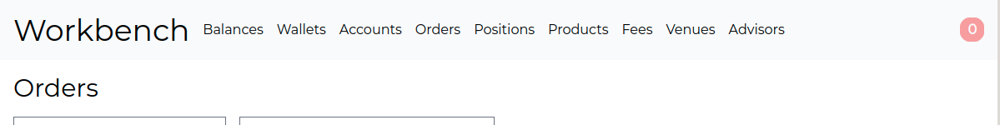

# Navigator
[](https://github.com/fremantle-industries/navigator/actions?query=workflow%3Atest)
[](https://hex.pm/packages/navigator)

Global navigation between multiple Phoenix endpoints, tailwindcss friendly



## Installation

Add the `navigator` package to your list of dependencies in `mix.exs`:

```elixir
def deps do
  [
    {:navigator, "~> 0.0.8"}
  ]
end
```

## Usage

Configure the navigation links in `config/config.exs`

```elixir
# config/config.exs
use Mix.Config

config :navigator,
  links: %{
    storefront: [
      %{
        label: "Storefront Home",
        to: {StorefrontWeb.Router.Helpers, :home_path, [StorefrontWeb.Endpoint, :index]},
        class: "text-4xl"
      },
      %{
        label: "Orders",
        to: {StorefrontWeb.Router.Helpers, :order_path, [StorefrontWeb.Endpoint, :index]}
      },
      %{
        label: "Admin",
        to: {AdminWeb.Router.Helpers, :home_url, [AdminWeb.Endpoint, :index]}
      }
    ],
    admin: [
      %{
        label: "Admin Home",
        to: {AdminWeb.Router.Helpers, :home_path, [AdminWeb.Endpoint, :index]},
        class: "text-4xl"
      },
      %{
        label: "Order Admin",
        to: {AdminWeb.Router.Helpers, :order_path, [AdminWeb.Endpoint, :index]}
      },
    ]
  }
```

Render the navigation in your phoenix templates

```elixir
<%= render Navigator, "horizontal.html", conn: @conn %>
```

## Authors

- Alex Kwiatkowski - alex+git@fremantle.io

## License

`navigator` is released under the [MIT license](./LICENSE)
